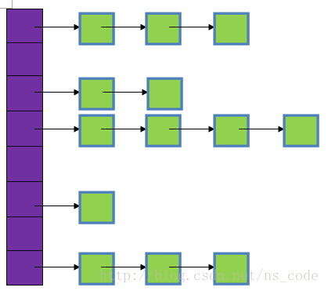

## equals() 与 hashCode()的区别
hashCode()是根据hash算法将每个对象计算得出hashcode，相同对象的hashCode一定相同，不同对象的hashCode可能相同

而equals()【如果不重写这个方法】是比较两个值得地址是否相等，

如下图就是又hash冲突之后解决冲突得常见方法；
利用散列表的方式实现数据存储，

其中每一行得hashcode值相同，然后就用链表得方式解决冲突，
