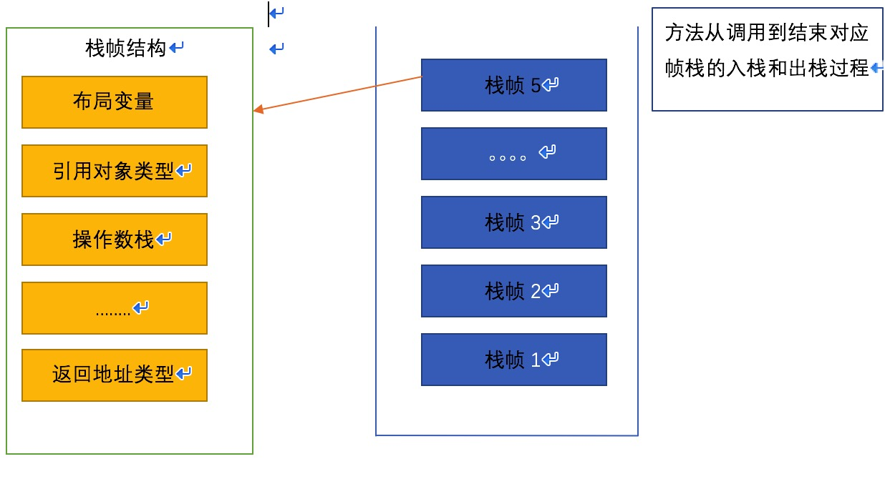
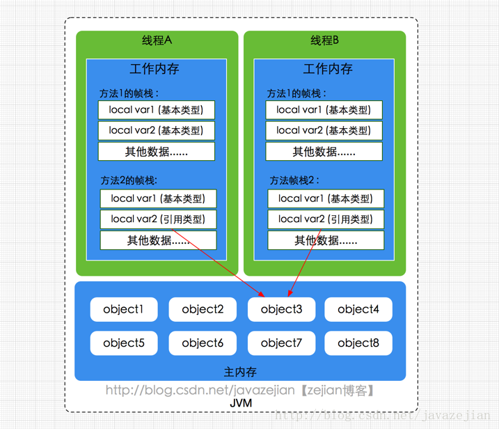
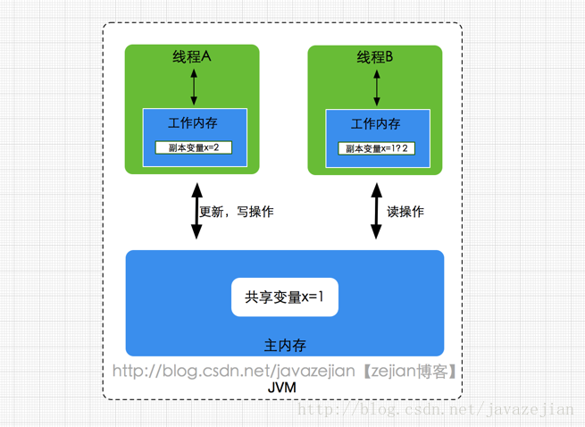

## java 内存模型
[参考博客](https://blog.csdn.net/javazejian/article/details/72772461)

先了解一下下面要用到的几个名词
## 1. 名词了解

## (1). 对象和对象引用

```java
//假设Person是一个类名
//1.
Person p = new Person("李月辉","男","22");
//2.
Person p;
p = new Person("李月辉","男","22");
```
接下来对其进行分析;[参考文章](http://www.cnblogs.com/focusChen/articles/2497768.html)

    我们知道1，2，两个是同一个意义，只不过2，将1，拆分写而已；
    2.中第一句，p 其实就是对象引用。只不过这个对象引用并没有指向任何一个对象，他的值目前是null；对象引用可以指向某个对象，也可以为null，只有这两种情况。
    2.中第二句，p 这个对象引用就被指向这个对象了，

```java
//下面这一句
Person p2;
p2 = p;
```

    这里发生了复制行为，但是要指明的是，对象并没有被复制，被复制的只是对象的引用，最后p2和p都是指向了那个对象。

    我们可以获得以下结论：

    （1）一个对象引用可以指向0个或1个对象；
    （2）一个对象可以有N个引用指向它；

## (2). 字面量

字面量这个词不只是java，所有的编程语言都有这个定义，
```java
//这里 10,"hello"就是字面量；
int a = 10;
String s = "hello";
```

## (3). 内存区域与内存模型

```
内存区域：内存分区
内存模型；就是模型啦
```

## 2. java内存区域

## java的堆，，本地方法栈，虚拟机栈，方法区，常量池

## (1). JVM堆
```
堆，是属于线程的共享区域，它在虚拟机启动时创建，是java虚拟机所管理的内存中的最大一块；

主要用于存放对象，几乎所有的对象实例都在这里分配内存；

同时java堆也是垃圾收集器管理的主要区域，因此很多时候也叫做GC堆；

如果堆中没有内存完成实例分配，并且堆也无法在扩展时，就会抛出OutOfMemoryErroy异常；
```

<font color=#ff0000 face=黑体 size=4>注意：堆中存放的是对象</font>

## (2). 虚拟机栈

```
栈，属于线程私有数据区域，与线程同时创建，总数与线程关联，代表java方法执行时都会创建一个栈帧来存储方法的变量表，操作数栈，动态链接方法，返回值，返回地址等信息。每个方法从调用直到结束就对于 一个栈帧在虚拟机栈中的入栈和出栈操作，(如图)
```




## （3）、 本地方法栈

```
本地方法栈属于线程私有的数据区域，这部分主要与虚拟机用到的 Native 方法相关，一般情况下，我们无需关心此区域。

这里之所以简要说明这部分内容，注意是为了区别Java内存模型与Java内存区域的划分，毕竟这两种划分是属于不同层次的概念。

```

## （4）、方法区

```
方法区属于线程共享的内存区域，又称Non-Heap（非堆），主要用于存储已经被虚拟机加载的类信息，常量，静态变量，即时编译器编译后的代码等数据，当方法区无法满足非配需求是，将抛出OutOfMemoryError异常。

方法区中存在一个叫 运行时常量池的区域，主要用于存放编译器生成的各种字面量和符号引用，这些内容将在类加载后存放到运行时常量池中，以便后续使用。
```

<font color=#ff0000>注意：方法区主要存放常量，静态变量，如下面的例子</font>
```java
private final static String = "ABCDE";
public static String = "hello";
```

## （5）、 程序计数器

```
、
属于线程私有的数据区域，是一小块内存空间，主要代表当前线程所执行的字节码行号指示器。字节码解释器工作时，通过改变这个计数器的值来选取下一条需要执行的字节码指令，分支、循环、跳转、异常处理、线程恢复等基础功能都需要依赖这个计数器来完成。
```
<font color=#ff0000>注意：程序计数器不在RAM上，而是直接划分在CPU上</font>


## 3. java内存模型


## (1).主内存 

```
主要存储的是Java实例对象，所有线程创建的实例对象都存放在主内存中，不管该实例对象是成员变量还是方法中的本地变量(也称局部变量)，当然也包括了共享的类信息、常量、静态变量。由于是共享数据区域，多条线程对同一个变量进行访问可能会发现线程安全问题。

这里包括了上面内存区域中的堆区，方法区，
```

## (2).工作内存

```
主要存储当前方法的所有本地变量信息(工作内存中存储着主内存中的变量副本拷贝)，每个线程只能访问自己的工作内存，即线程中的本地变量对其它线程是不可见的，就算是两个线程执行的是同一段代码，它们也会各自在自己的工作内存中创建属于当前线程的本地变量，当然也包括了字节码行号指示器、相关Native方法的信息。注意由于工作内存是每个线程的私有数据，线程间无法相互访问工作内存，因此存储在工作内存的数据不存在线程安全问题。
```

```
弄清楚主内存和工作内存后，接了解一下主内存与工作内存的数据存储类型以及操作方式。
根据虚拟机规范，
1. 对于一个实例对象中的成员方法而言
    如果方法中包含本地变量是基本数据类型(boolean, byte, short,char, int, long, float, double)，将直接存储在工作内存的帧栈结构中；
    但倘若本地变量是引用类型，那么该变量的引用会存储在功能内存的帧栈中，而对象实例将存储在主内存(共享数据区域，堆)中。

2. 但对于实例对象的成员变量
    不管它是基本数据类型或者包装类型(Integer、Double等)还是引用类型，都会被存储到堆区；
    至于static变量以及类本身相关信息将会存储在主内存中
    
需要注意的是，在主内存中的实例对象可以被多线程共享，倘若两个线程同时调用了同一个对象的同一个方法，那么两条线程会将要操作的数据拷贝一份到自己的工作内存中，执行完成操作后才刷新到主内存，简单示意图如下所示：
```



## 4. 提出问题

```
由于JVM运行程序的实体是线程，而每个线程创建时JVM都会为其创建一个工作内存(有些地方称为栈空间)，用于存储线程私有的数据，线程与主内存中的变量操作必须通过工作内存间接完成，主要过程是将变量从主内存拷贝的每个线程各自的工作内存空间，然后对变量进行操作，操作完成后再将变量写回主内存，如果存在两个线程同时对一个主内存中的实例对象的变量进行操作就有可能诱发线程安全问题。

如下图，主内存中存在一个共享变量x，现在有A和B两条线程分别对该变量x=1进行操作，A/B线程各自的工作内存中存在共享变量副本x。假设现在A线程想要修改x的值为2，而B线程却想要读取x的值，那么B线程读取到的值是A线程更新后的值2还是更新前的值1呢？

答案是，不确定，即B线程有可能读取到A线程更新前的值1，也有可能读取到A线程更新后的值2，这是因为工作内存是每个线程私有的数据区域，而线程A变量x时，首先是将变量从主内存拷贝到A线程的工作内存中，然后对变量进行操作，操作完成后再将变量x写回主内，而对于B线程的也是类似的，这样就有可能造成主内存与工作内存间数据存在一致性问题;

假如A线程修改完后正在将数据写回主内存，而B线程此时正在读取主内存，即将x=1拷贝到自己的工作内存中，这样B线程读取到的值就是x=1，但如果A线程已将x=2写回主内存后，B线程才开始读取的话，那么此时B线程读取到的就是x=2，但到底是哪种情况先发生呢？这是不确定的，这也就是所谓的线程安全问题。 
```

